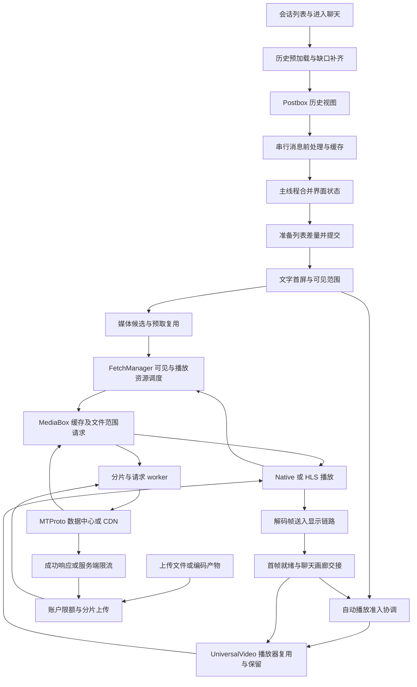

# Turrit 1.5.4 聊天、播放与文件传输链路审计

分析日期：2026-09-30。样本为用户提供的 Turrit **1.5.4（10382）**；对照同日 Regram 工作树及[媒体加载试验 b34575](media-loading-experiment.md)。本轮只补充静态分析和文档，没有修改 App 行为、重新编译、安装或测速。

后续用户已要求接入五块机制；当前实现范围和验证状态见[试验记录](media-loading-experiment.md)。本文保留审计时的 b34575 对照，不能作为后续代码仍缺少这些机制的说明。

进一步针对画质、滚动通知、连接和数据库的检查见[补充机制调查](turrit-1.5.4-additional-mechanisms.md)，其中区分了新增能力、共有实现和未验证线索。

**前次分析漏掉了播放器对象保留、自动播放准入、HLS 片段准入、首帧与画廊交接，以及独立串行消息处理队列。b34575 覆盖的是预取与资源调度，其中的“两个自动任务”并不等于 Turrit 的“两个自动播放视频”。**

新发现能解释它如何减少重复初始化和资源竞争，但尚不能证明哪一项造成了用户观察到的速度差。上传下载“突破上限”保留为待核实线索：已检查的常规传输路径没有提供绕过服务端限额的证据。

## 已检查的主要链路

下面按客户端阶段组织。网络返回、磁盘速度、运行时配置和 iOS 解码表现属于运行时边界；静态检查不等于端到端性能测试。

| 阶段 | Turrit 的可复核发现 | Regram / b34575 对照 | 证据边界 |
| --- | --- | --- | --- |
| 会话列表预加载触发 | 有预加载触发、候选变更及跳过计算的分支和诊断 | 我们也有上游历史预加载；b34575 未改会话历史预加载 | 没有完整恢复所有触发条件，不能宣称点击前一定已加载全部聊天 |
| 历史补洞 | 预加载同时启动的历史任务上限 3；任务启动延迟 0.3 秒；该请求参数为 60 条 | 我们也有 0.3 秒 / 60 条的路径 | 这些是预加载路径参数，不代表所有首屏历史 RPC 的分页 |
| 初始历史窗口 | 默认 44；过滤场景有动态扩大窗口的实现 | 默认同为 44；我们也已有过滤后窗口补偿 | 没有“默认多拉一批就更快”的证据 |
| 本地历史与存储 | Postbox、历史视图和 SqliteValueBox 体系仍存在 | 我们使用同一家族 | 未逐个比较数据库查询、索引及磁盘实现，不能断言完全相同 |
| 消息前处理 | 新增 `SerialMessageQueue`，QoS 为 `.userInitiated`；三路输入合并、去重及消息处理后进入主线程组合 | 我们的规则匹配已有专用后台队列；没有该全局消息队列 | 后台处理的是部分消息逻辑，不能说全部排版都离开了主线程 |
| 首屏组合与提交 | 后续仍在主线程合并 27 路输入；记录 transition 准备、排队和完成时间 | 我们也保留主线程组合、差量和 ListView transaction | 诊断记录不等于优化；未证明全部首屏依赖被解除 |
| 聊天显示等待 | 查到 0.8 秒 ready 超时路径 | 我们对应路径也为 0.8 秒 | 不是每次固定等待 0.8 秒，超时信号也不能当作文字首屏时间 |
| 媒体预取 | 6 个候选、1.5 秒延迟释放、最多 3 个待释放任务、输入去重 | b34575 已参考实现 | 原有权限、自动下载设置仍决定任务是否启动 |
| 资源与片段调度 | 可见资源、预取资源、当前流资源调度；HLS 片段还经过独立准入 | b34575 已有资源优先级与分类任务限额，缺少 HLS 片段准入 | 我们的权重和分类限额是试验选择，不是完整还原 |
| 自动播放与播放器生命周期 | 页面协调器最多准入 2 个自动播放视频；管理器配置 inline holder 3、保留 holder 1、每 session 保留 1 | b34575 未实现这两层 | 自动播放数量、活跃 holder 和保留 holder 是不同概念 |
| 首帧与画廊返回 | 增加 `displayReady`、画廊交接状态及 0.1 秒返回恢复计时 | 我们没有这套新增的交接协议 | 信号代表帧已送入显示链路，实际屏幕呈现仍需设备测量 |
| 上传下载 | 普通下载 128 KiB / 6；上传有 3 / 30 并发；请求管理器 3 requests / worker、4 workers / target | 我们已有对应参数或分支 | 未完整恢复界面倍率到所有底层路径的映射；未证实超限 |

## 文字聊天：新增队列、缓存与首屏依赖

Turrit 增加了 `SwiftSignalKit.Queue.serialMessageQueue()`。这不是只凭函数名推断：getter 经 once 初始化独立 Queue，label 为 **`SerialMessageQueue`**，构造前明确调用 `.userInitiated` QoS getter。

聊天历史输入构造中，`0x002BA460` 获取该队列，`0x002BA488` 在它上面合并三路输入，随后进入 `distinctUntilChanged` 和 `mapToQueue`。消息处理回调继续经过 deferred / processor 路径。`0x002BA5CC` 再获取主队列，`0x002BA6BC` 合并 27 路输入。因此可以确认它把一部分消息前处理与主线程提交分开；不能将它描述成“整个 Postbox、历史请求和 UI 排版全部搬到后台”。

我们已有[规则匹配后台处理](../submodules/TelegramUI/Sources/ChatHistoryListNode.swift#L1996)，使用 `regram.chat-history-filter` 和缓存判定；后面的[主线程组合](../submodules/TelegramUI/Sources/ChatHistoryListNode.swift#L2017)仍在。已有后台处理不代表我们覆盖了 Turrit 的整个消息处理器，也不能在没有采样时把规则匹配认定为瓶颈。

沿消息处理器又追到了两类缓存：

- `TrChatHistoryMessageProcessor` 持有 FastText 分类缓存、已隐藏消息集合及处理/预测计数；实际调用 `BundledTelegramContentClassifier.predictMessages`。IPA 内含 `telegram-content-classifier-v3.ftz`。分类缓存条目包含 `contentKey` 和 `isAd`，处理分支比较内容并复用结果。这是它的消息广告分类路径，是否开启仍由设置决定；不能把模型存在解释为网络或历史加载加速。
- 翻译资格缓存包含 `stableVersion`、目标语言、文本前缀、忽略语言键、完整语言检查开关、资格和来源语言等字段；另有翻译及资格判定的 in-flight 集合。语言统计有 **1 秒节流**，统计路径使用独立队列和 semaphore。缓存字段、集合维护及节流已确认，所有失效条件和每条首屏消息是否命中缓存尚未完整恢复。

默认历史窗口仍是 **44**。Turrit 的 `tr_historyMessageCount` 路径出现 2/3/4/8 倍的过滤后补偿，以及 0.35 的比较常量；这不是默认页大小或已确认的全局上限。我们也有[过滤后窗口补偿](../submodules/TelegramUI/Sources/ChatHistoryListNode.swift#L3576)，不应把动态扩窗全部当成我们缺失的能力。

历史预加载的 **0.3 秒 / 60 条**已从具体启动分支、常量和回调参数确认，与我们的[对应实现](../submodules/TelegramCore/Sources/State/ChatHistoryPreloadManager.swift#L96)相同。这说明单凭这组参数无法解释它更快；其他历史请求和服务端返回仍需分别测量。

首屏后段保留了多输入组合和列表差量提交。发现的 `recordChatDisplayTransitionPrepared`、`recordChatDisplayTransactionCompleted` 测量了准备耗时、队列等待和剩余深度，说明它有定位瓶颈的工具；这些调用本身不减少等待。ready 超时仍有 0.8 秒，与我们的[对应路径](../submodules/TelegramUI/Sources/Chat/ChatControllerLoadDisplayNode.swift#L876)一致。尚无充分证据认定 Turrit 已将所有慢附加数据移出首屏门槛。

## 视频：资源缓存之外，还有播放器与交接

### 自动播放准入和更新合并

`ChatHistoryListNodeImpl` 新增播放 session、admission timer、画廊恢复 timer 和交接状态。候选信息包含是否可播放、可见比例、到视口中心的距离、用户发起、是否有声音、是否已准入及 stableId；协调器确实读取候选、排序并将准入结果应用回媒体节点。

已确认的限额分支：控制器活跃且 `NSProcessInfo.thermalState` 不是 `.critical` 时返回 **2**，否则返回 **0**。这描述自动播放准入，不能推广为所有手动播放也只能两个。排序使用用户发起、位置、可见比例和已有准入等信息，本报告不将尚未逐一还原的排序条件写成完整算法。

准入变化使用 **0 秒、非重复 Timer** 合并更新，已有 timer 时返回。目的可能是把同一轮列表变化汇总再协调，而不是人为增加播放等待；是否减少滚动开销需要运行时数据。

b34575 限制的是 FetchManager 分类中的自动下载任务。它没有给实际视频播放/解码建立上述集中准入，所以不能声称已实现 Turrit 的 `chatMaxActiveVideoPlayers = 2`。

### 小规模播放器保留池

`UniversalVideoManagerImpl` 除活跃 `holders` 外，还增加 `retainedHolders`、保留顺序、每 session 的 preferred content，以及 `.inlineAutoplay` / `.none` 保留策略。构造和常量 getter交叉确认配置值为：inline holder **3**，保留 inline holder **1**，每 session 保留 **1**；实际保留仍受空余容量等分支约束。

detach、retain 和 attach 路径会将 holder 放入保留结构或重新取出，并按 session/preferred content 管理交接。保留的是持有播放节点的对象，因此有机会减少回滑和画廊返回时的播放器重建；它与 MediaBox 中已缓存的文件字节不同。

我们[最后订阅者 detach 的实现](../submodules/TelegramUniversalVideoContent/Sources/UniversalVideoContentManager.swift#L223)会从 holder 字典移除，未新增该保留池。Turrit 还出现内存、后台、温度、容量和 handoff 淘汰相关分支/日志，但本轮没有将每一项触发与淘汰策略完整还原，不据此给出完整内存管理伪代码。

### 保留期间暂停 HLS，以及片段准入

Turrit HLS 节点新增 `tr_retainedLoadingSuspended`、`tr_segmentRequests` 和 `tr_fetchManager`。

悬停状态变化会执行 `instance.hls.stopLoad();`；恢复时，根据加载状态选择 `instance.hls.startLoad(-1);` 或刷新播放状态。另一个原生加载分支读取悬停标志后跳过继续加载。也就是说，保留播放节点时可以同时停止新增加载，避免保留池自动变成持续后台下载。

片段请求另外进入 `foregroundStreamingPriority(resourceId:)`。其映射根据准入结果进入实际文件范围请求，或返回 `Signal.complete()`；请求还登记在字典中，取消时移除并 dispose。当前选中的流资源会影响其他资源的准入。已确认有这道控制，不将所有未恢复的切换/恢复时序写成保证。

b34575 对 HLS playlist 和 quality 资源添加了优先级，却没有新增保留加载悬停，也没有这套片段级准入。给整个资源加权与决定某个片段现在是否启动，是两层不同的控制。

另外逐字节比较了聊天播放器的 HlsBundle：

| 文件 | 大小 | 与 Regram 是否一致 | SHA-256 |
| --- | --- | --- | --- |
| `index.bundle.js` | 413716 字节 | 一致 | `77f3923091ea2a320d8c11971672d579fa5d42ebd91ee0b9ce8f9473842a4d91` |
| `headless_prologue.js` | 682 字节 | 一致 | `0046327cdbc99fed8b8c7593cc6aec052997dd82d4109162dbf9033e50232685` |
| `index.html` | 207 字节 | 一致 | `6caa8c5455f84f950ac11a39cf4820b2c5e0caa64d2ff274eda3304ac88d07f9` |

因此已确认的差异集中在原生层的调度、调用和生命周期。本结论只覆盖上述聊天播放器 bundle；App 根目录还存在其他播放页面和 `hls.js`，不能把它推广成全部视频页面的脚本都一致。

### 首帧就绪与画廊返回

HLS 首次收到“帧已送往显示”的 callback 时，除了显示 playerNode，还发出新增的 `tr_displayReadyPromise`。`UniversalVideoNode.displayReady` 将它传给聊天媒体节点，后者确实订阅了该信号。我们的 HLS 也已有显示第一批帧时取消隐藏的处理，但[现有 ready](../submodules/TelegramUniversalVideoContent/Sources/HLSVideoJSNativeContentNode.swift#L1150)由缩略图更新触发，缺少这套向上层提供的首帧协议。

画廊返回有 prepare / complete / finish 和 suspend 状态，并安排 **0.1 秒**恢复计时；回调再协调自动播放、完成返回交接。这个计时不是已测得的首帧时间，也不能说每次必定额外等待 0.1 秒。

结合保留池和首帧信号，它有机会减少“全屏返回聊天时重新创建播放器、封面与播放画面切换”的重复工作。这是从调用关系推导的作用，尚未在设备上验证闪烁、返回延迟或内存变化。

独立视频信息流另有相邻播放器缓存、下一条资源预取；[前次报告](turrit-1.5.4-performance-analysis.md)已记录当前/前一条/后一条节点和后面两条 Native 资源预取。普通聊天的预取与信息流整文件预取不能混用为一个策略，b34575 也没有新增视频信息流页面。

## 上传下载：已确认参数与“突破上限”线索

按用户最新要求，这部分先记录证据，不因宣传倍率或观感修改参数。

| 位置 | Turrit 样本 | 我们的实现 | 结论 |
| --- | --- | --- | --- |
| FetchV2 普通下载 | 初始分片 128 KiB、并发 6 | 默认相同；已有独立下载加速档位 | 没有此路径靠更大默认分片取胜的证据 |
| 请求 worker | 每 worker 最多 3 个请求、每 target 最多 4 个 worker | [参数相同](../submodules/TelegramCore/Sources/Network/MultiplexedRequestManager.swift#L206) | 这是 worker 调度限制，不能直接乘成账号带宽或真实 socket 数 |
| MultipartUpload | 普通 3、增加并发时 30 | [已有同样分支](../submodules/TelegramCore/Sources/Network/MultipartUpload.swift#L154) | 构造函数支持 30 不等于所有上传默认使用 30 |
| 上传分片 | 大文件 512 KiB；小文件普通 128 KiB、larger 模式 256 KiB | 同样参数；`uploadSpeedBoost` 已接 larger / parallel 分支 | 尚未确认 Turrit UI 倍率如何作用于所有调用者 |
| 上传最大分片数 | 默认 fallback 4000；配置解析根据 Premium 选择后缀 | [同样按账户配置读取](../submodules/TelegramCore/Sources/State/UserLimitsConfiguration.swift#L170) | 没有常规路径无条件解除分片限额的证据 |
| 服务端限流 | 上传回调仍处理 `FLOOD_PREMIUM_WAIT`；MtProtoKit 解析等待秒数并记录 flood wait | 同一家族处理能力 | 没有服务端 Premium 限速被取消的证据 |

Telegram 官方文件协议允许调节并发请求和独立连接队列，同时规定上传分片大小及按账户配置的最大分片数；`FLOOD_PREMIUM_WAIT_X` 仍是服务端返回的等待错误。提高客户端并发能够减少本地排队，不能据此认定绕过服务端速度或大小限制。[官方文件传输协议](https://core.telegram.org/api/files)

单文件大小还要区分上传与下载：非 Premium 用户本来就可以下载 Premium 用户上传的 4 GB 文件；Premium 则解除 Telegram 侧的媒体下载速度限制，其他网络/硬件瓶颈仍可能存在。因此“普通账户能下载大于 2 GB”并不是破解上传上限的证据。[官方 Premium FAQ](https://telegram.org/faq_premium)

样本中存在 `/upload/oss_config`、PikPak 和自有发现/推荐接口。仅有这些接口不足以说明普通 Telegram 附件经过中转、分拆后再作为一个超限文件完成发送。已追踪的常规上传仍进入 MultipartUpload / Telegram 文件 RPC；未找到并验证超限单文件最终被服务端接纳的链路。不能用“允许选择文件”或“开始上传”替代发送完成与接收端校验。

实际带宽差仍可能受缓存、媒体质量、账户权限、数据中心、代理/网络路径和请求排队影响；这些是需要控制的实验变量，不是本次证实的 Turrit 特有技术。

## 二进制证据定位

以下为对应框架中未加 ASLR slide 的虚拟地址。必须同时使用框架名和地址；同一个数值在不同框架里可能是无关函数。证据来自 exports、Swift 字段元数据、lazy binding、function starts、常量与 ARM64 分支交叉检查，没有恢复完整源码。

| 框架 | 地址 | 已确认内容 |
| --- | --- | --- |
| SwiftSignalKitFramework | `0x0000F890` / `0x0000F718` / `0x0000F94C` | serial message queue getter、once initializer、Queue 构造；QoS getter 在 `0x0000F76C` |
| UI | `0x002BA460` / `0x002BA488` / `0x002BA564` | 串行队列、三输入组合与 mapToQueue |
| UI | `0x002BA5CC` / `0x002BA6BC` | 回到主队列后合并 27 路输入 |
| UI | `0x002C8D90` → `0x002EE208` → `0x002C8FC8` | deferred 消息处理路径 |
| UI | `0x002F3AEC`，调用点 `0x002F4468` / `0x002F447C` | 分类缓存处理、bundled classifier 及 predictMessages 调用 |
| UI | `0x002B6648` / `0x002C50C4` | 语言统计节流、统计队列与 semaphore 路径 |
| UI | `0x002CFCC4` / `0x002D9468` | 默认历史窗口 44、过滤后动态窗口分支 |
| Core | `0x002CB8F0`，比较点 `0x002CC04C` | 历史预加载并发上限 3 |
| Core | `0x002C8958`，常量 `0x01033248` | 历史预加载启动、delay 0.3 |
| Core | `0x002C8B98`，参数写入 `0x002C8CE8` / `0x002C8CEC`，回调 `0x002CE07C` | 补洞请求 60 条参数及转交 |
| UI | `0x000945BC`，常量 `0x04966920` | ready timeout 0.8 秒 |
| UI | `0x002C9914` / `0x002DBA98` | transition 准备和 transaction 完成诊断 |
| UI | `0x002B4AFC` / `0x002D4210` / `0x002BB064` | 播放准入协调、温度/活跃限额、更新合并 |
| UI | `0x01E98DC4` / `0x01E99B40` | 获取候选准入信息、应用结果 |
| UI | `0x02C402EC` / `0x02C402F4` / `0x02C402FC` / `0x02C74354` | holder 配置 3 / 1 / 1、构造写入 |
| UI | `0x02C74A48` / `0x02C75F18` / `0x02C76198` / `0x02C76B08` | attach、detach、保留 helper、preferred handoff |
| UI | `0x02C5B26C` / `0x02C54474` | HLS 悬停切换、加载分支检查 |
| UI | `0x02C5341C` / `0x02C568E4` / `0x02C56AC0` | HLS 片段准入调用、bool 映射、取消登记请求 |
| UI | `0x0180AE90` / `0x0180AF80` | foreground streaming API 及资源选择映射 |
| UI | `0x02C58B7C` / `0x032296AC` / `0x01EA1C94` | 首帧 callback、displayReady API、聊天节点订阅 |
| UI | `0x002A9188`，常量 `0x04966940`，回调 `0x002D4798` | 画廊返回计时 0.1 秒及恢复 |
| Core | `0x00195F6C` / `0x00198CF4` | 上传管理器参数和创建路径 |
| Core | `0x003DAD84`，默认常量 `0x01038B98` | 按账户解析上传分片限额、fallback 4000 |
| Core | `0x0019C6DC` / `0x00199868` | 请求 worker 调度、上传 Premium 限流处理 |
| MtProtoKitFramework | `0x00050E58`，Premium 分支 `0x000521B8` | RPC 错误接收、等待秒数和 flood wait 记录 |

样本指纹与首次分析一致：

- Core SHA-256：`ac7342a5918a0f65098115ee4f2a53d0caa8968cfbbb26d76d03285e96e81215`。
- UI SHA-256：`2fb473f7a13bff11f66e66d9788fc70c9572388302a099013bd20dc73468c514`。

两个框架 `cryptid = 0`，已再次核对原 IPA 成员。精简证据、引用扫描和常量表保存在被忽略的 `build-input/turrit-analysis/deep/`；二进制留在本地临时目录，不加入仓库。证据文件名不替代函数验证，分析中已修正误标为保留 helper 或补洞启动的几个辅助函数。

## 试验版缺口与后续验证

b34575 已有输入去重、6 个候选、1.5 秒任务复用和可见/播放资源调度；会话备份删除也已包含在该包。本轮没有继续扩大实现范围。

下一轮实现值得优先评估的是播放准入、有限保留池、保留期间停止加载和首帧/画廊交接这一组互相依赖的机制；只加保留池会带来额外内存和后台请求，不能孤立照抄。文字消息则先测主线程准备和等待，再决定扩展后台处理的范围；我们已有后台规则匹配和窗口补偿，需要避免重复实现。

| 要回答的问题 | 需要记录的事件或控制变量 |
| --- | --- |
| 文字为什么更早出现 | 点击聊天、首个历史视图、前处理结束、组合首次输出、差量准备结束、ListView 完成；附加输入等待与主线程耗时分别记录 |
| 视频是否真的更早播放 | 点击/进入可见范围、准入、首次范围请求、首个分片可用、解码帧送入显示；封面 ready 分开记录 |
| 回滑/画廊返回是否省重建 | holder 与播放器创建/销毁次数、保留命中、暂停加载、恢复准入与首帧时间 |
| 上传下载是否提高真实吞吐 | 同文件同账户同网络、冷缓存、相同视频质量；统计成功传输字节和总耗时，不以 UI 倍率或瞬时峰值判定 |
| 是否有单文件超限能力 | 上传完成、服务端确认的单个 document 大小，以及接收端完整下载后的长度/校验；选择器与进度条不足为证 |
| 改进是否有代价 | 内存峰值、滚动卡顿、热状态、总下载字节、手动下载执行机会、前后台及网络切换恢复 |

本轮文档链接和差异检查通过；没有 App 编译或连接真机的运行结果。b34575 的既有编译、策略测试和参考包检查见[试验记录](media-loading-experiment.md#已完成验证构建-34575)。实际快多少、哪段最慢，以及动态服务端/第三方路径仍未验证。
